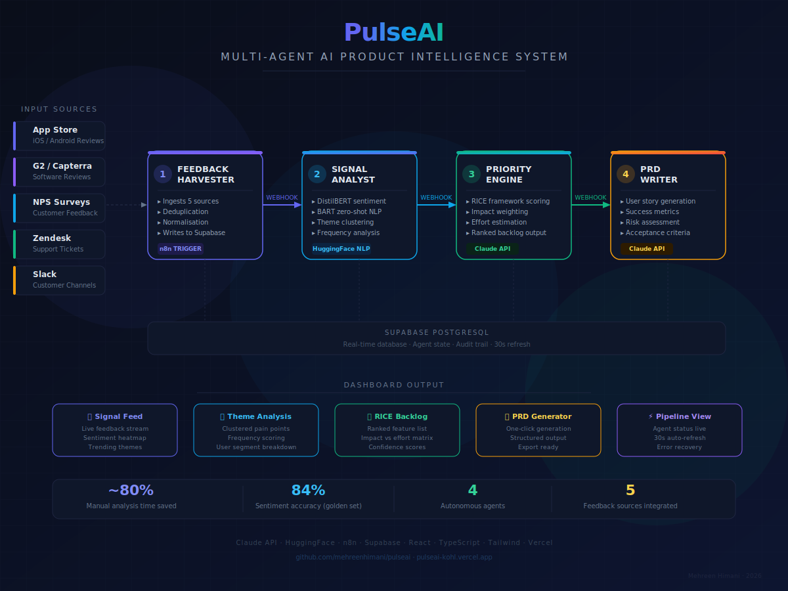

# PulseAI — Multi-Agent AI Product Intelligence System

Multi-agent AI pipeline that autonomously harvests product feedback, 
analyses sentiment, scores features using RICE framework, and 
generates structured PRDs — reducing manual analysis time by ~80%.

[→ Live Demo](https://pulseai-kohl.vercel.app) · [→ Case Study](https://github.com/mehreenhimani/pulseai/blob/main/PulseAI_Case_Study_Mehreen.docx)

---

## 🏗️ Architecture & System Design

---

## The Problem

Product teams at scaling companies are drowning in feedback signals — 
app store reviews, NPS responses, support tickets, G2 reviews, Slack 
channels. Industry reality: most PMs process less than 10% of available 
customer feedback before making roadmap decisions. The cost isn't just 
missed insights — it's roadmaps built on gut feel, churn hiding in 
unread signals, and high-frequency pain points that never surface until 
they become a retention crisis.

---

## My Approach

Built a 4-agent autonomous pipeline that:

- **Harvests** feedback continuously from 5 sources (App Store, G2, 
  NPS, Zendesk, Slack) — deduplicates, normalises, and stores in 
  real time
- **Analyses** sentiment and clusters themes using HuggingFace NLP 
  (DistilBERT, BART) — catching emerging patterns before they become 
  crises
- **Scores** every feature request using RICE framework via Claude API 
  with constrained JSON output — data-driven prioritisation, not lobbying
- **Generates** structured PRDs automatically for top-ranked features — 
  problem statement, user stories, success metrics, acceptance criteria

---

## Key Product Decisions

**Why multi-agent over a single LLM call?** Specialisation produces 
better results. DistilBERT fine-tuned for sentiment outperforms a 
general LLM doing sentiment + RICE + PRD in one prompt. Each agent 
is optimised for its single task.

**Why constrained JSON schema for RICE scoring?** Unconstrained LLM 
scoring produces confident-sounding but inconsistent results. The 
schema requires explicit data inputs before scoring — if data is 
missing, the agent flags it rather than guessing.

**Why webhook-based sequential triggers?** Debuggability and audit 
traceability over raw speed. In any production system, being able to 
trace exactly what each agent did and why matters more than saving 
30 seconds of processing time.

**Why a golden evaluation set before integration?** Building the 
20-item labelled test set first forced clarity on what good sentiment 
classification meant for product feedback — before any model was 
integrated.

---

## Screenshots

| Signal Feed | RICE Backlog | PRD Generator |
|------------|--------------|---------------|
|  |  |  |

---

## Metrics Framework

- **Primary:** Manual feedback analysis time reduction (target: >70%, 
  achieved: ~80%)
- **Secondary:** Sentiment accuracy (84% on 20-item golden eval set), 
  PRD generation time (seconds vs 2-3hrs manually)
- **Guardrails:** Hallucination rate on RICE scores (constrained schema 
  = zero uncited scores), agent pipeline uptime >95%

---

## Tech Stack

n8n (orchestration) · HuggingFace (DistilBERT, BART) · Claude API · 
Supabase (PostgreSQL) · React 18 · TypeScript · Tailwind · Vercel · 
Lovable

Mock data: 5 feedback sources · 20-item golden evaluation set · 
Real-time 30s refresh

---

## What I'd Do Differently

- Build real OAuth integrations for all 5 sources — App Store Connect, 
  Zendesk, and Slack each require rate limiting and pagination handling 
  that mock data doesn't surface
- Fine-tune a supervised classifier on 500+ labelled examples per 
  category — zero-shot BART achieves ~80%; supervised would reach 90%+
- Add competitor signal monitoring — G2 and App Store reviews for 
  competitor products are often the highest-signal roadmap input
- Build push delivery (Slack/email) for weekly PRD summaries — 
  requiring PMs to visit the dashboard reduces adoption vs. pushing 
  to where they already work
